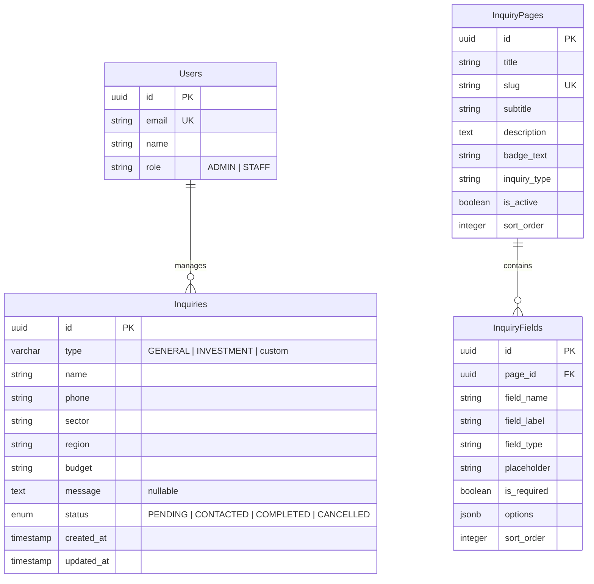

# Real Estate Inquiry DB Schema Design

This document defines the database schema for the real estate landing page inquiry management. Designed for PostgreSQL (Neon DB).

## Entity Relationship Diagram (ERD)

## Table Definitions

### `inquiries` Table
Stores all incoming requests from the landing page.

| Column | Type | Constraints | Description |
| :--- | :--- | :--- | :--- |
| `id` | UUID | PK, DEFAULT gen_random_uuid() | Unique identifier |
| `type` | VARCHAR(50) | NOT NULL | 'GENERAL', 'INVESTMENT', or custom |
| `name` | VARCHAR(100) | NOT NULL | Applicant name |
| `phone` | VARCHAR(20) | NOT NULL | Applicant contact number |
| `sector` | VARCHAR(100) | NULLABLE | Interested field (from general form) |
| `region` | VARCHAR(100) | NULLABLE | Target region (from investment form) |
| `budget` | VARCHAR(50) | NULLABLE | Budget range (from investment form) |
| `message` | TEXT | NULLABLE, DEFAULT '-' | Detailed message or extra data |
| `status` | ENUM | DEFAULT 'PENDING' | Workflow status |
| `created_at` | TIMESTAMP | DEFAULT NOW() | Time of submission |
| `updated_at` | TIMESTAMP | DEFAULT NOW() | Last modification time |

### `users` Table

| Column | Type | Constraints | Description |
| :--- | :--- | :--- | :--- |
| `id` | UUID | PK, DEFAULT gen_random_uuid() | Staff unique ID |
| `email` | VARCHAR(255) | UK, NOT NULL | Login email |
| `name` | VARCHAR(100) | NOT NULL | Staff name |
| `role` | VARCHAR(20) | DEFAULT 'STAFF' | Access level (ADMIN or STAFF) |

### `inquiry_pages` Table
Stores configurable inquiry/contact form pages.

| Column | Type | Constraints | Description |
| :--- | :--- | :--- | :--- |
| `id` | UUID | PK, DEFAULT gen_random_uuid() | Page unique ID |
| `title` | VARCHAR(200) | NOT NULL | Page display title |
| `slug` | VARCHAR(100) | UNIQUE, NOT NULL | URL identifier |
| `subtitle` | VARCHAR(300) | | Page subtitle |
| `description` | TEXT | | Page description |
| `badge_text` | VARCHAR(50) | DEFAULT 'Contact Us' | Badge label |
| `inquiry_type` | VARCHAR(50) | DEFAULT 'GENERAL' | Form inquiry type |
| `is_active` | BOOLEAN | DEFAULT true | Active status |
| `sort_order` | INTEGER | DEFAULT 0 | Display order |
| `created_at` | TIMESTAMP | DEFAULT NOW() | |
| `updated_at` | TIMESTAMP | DEFAULT NOW() | |

### `inquiry_fields` Table
Stores form fields for each inquiry page.

| Column | Type | Constraints | Description |
| :--- | :--- | :--- | :--- |
| `id` | UUID | PK, DEFAULT gen_random_uuid() | Field unique ID |
| `page_id` | UUID | FK → inquiry_pages(id) | Parent page |
| `field_name` | VARCHAR(100) | NOT NULL | Data key (english) |
| `field_label` | VARCHAR(200) | NOT NULL | Display label |
| `field_type` | VARCHAR(20) | DEFAULT 'text' | Input type |
| `placeholder` | VARCHAR(300) | | Placeholder text |
| `is_required` | BOOLEAN | DEFAULT true | Required flag |
| `options` | JSONB | DEFAULT '[]' | Options for select type |
| `sort_order` | INTEGER | DEFAULT 0 | Display order |
| `created_at` | TIMESTAMP | DEFAULT NOW() | |
