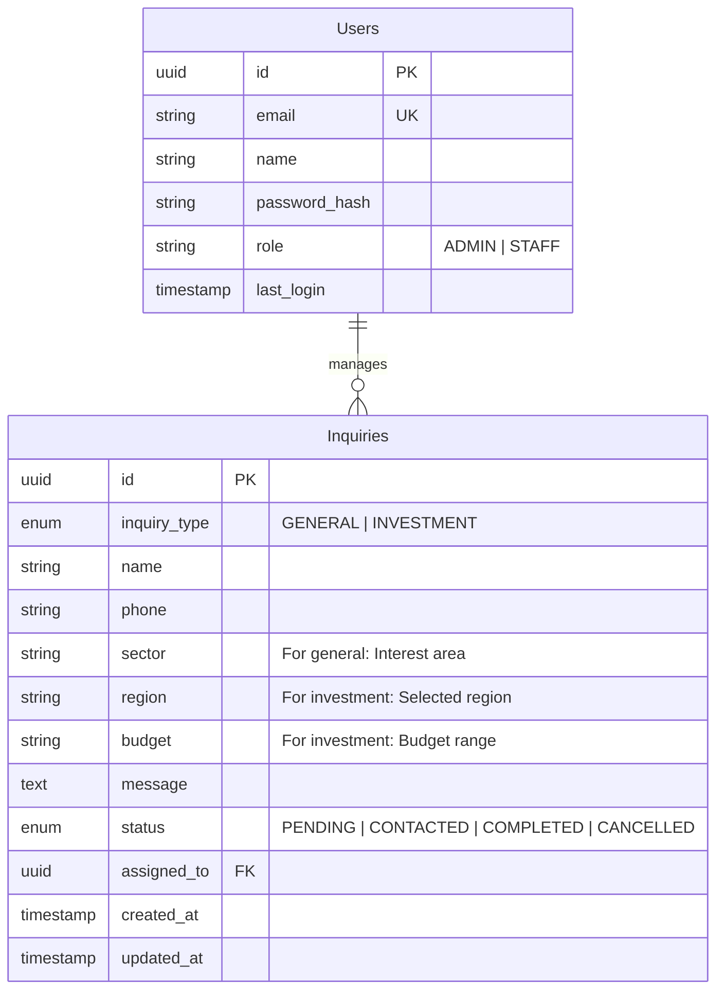

# Real Estate Inquiry DB Schema Design

This document defines the database schema for the real estate landing page inquiry management. It's designed for a relational database like PostgreSQL or MySQL.

## Entity Relationship Diagram (ERD)



## Table Definitions

### `inquiries` Table
Stores all incoming requests from the landing page.

| Column | Type | Constraints | Description |
| :--- | :--- | :--- | :--- |
| `id` | UUID | PK, DEFAULT gen_random_uuid() | Unique identifier |
| `type` | ENUM | NOT NULL | 'GENERAL' or 'INVESTMENT' |
| `name` | VARCHAR(100) | NOT NULL | Applicant name |
| `phone` | VARCHAR(20) | NOT NULL | Applicant contact number |
| `sector` | VARCHAR(100) | NULLABLE | Interested field (from general form) |
| `region` | VARCHAR(100) | NULLABLE | Target region (from investment form) |
| `budget` | VARCHAR(50) | NULLABLE | Budget range (from investment form) |
| `message` | TEXT | NOT NULL | Detailed message |
| `status` | ENUM | DEFAULT 'PENDING' | Workflow status |
| `assigned_to` | UUID | FK -> users(id) | Staff member assigned to handle |
| `created_at` | TIMESTAMP | DEFAULT NOW() | Time of submission |
| `updated_at` | TIMESTAMP | DEFAULT NOW() | Last modification time |

### `users` Table
Stores administrative and staff accounts for the management dashboard.

| Column | Type | Constraints | Description |
| :--- | :--- | :--- | :--- |
| `id` | UUID | PK, DEFAULT gen_random_uuid() | Staff unique ID |
| `email` | VARCHAR(255) | UK, NOT NULL | Login email |
| `name` | VARCHAR(100) | NOT NULL | Staff name |
| `role` | VARCHAR(20) | DEFAULT 'STAFF' | Access level (ADMIN or STAFF) |

## SQL DDL Example (PostgreSQL)

```sql
CREATE TYPE inquiry_type AS ENUM ('GENERAL', 'INVESTMENT');
CREATE TYPE inquiry_status AS ENUM ('PENDING', 'CONTACTED', 'COMPLETED', 'CANCELLED');

CREATE TABLE users (
    id UUID PRIMARY KEY DEFAULT gen_random_uuid(),
    email VARCHAR(255) UNIQUE NOT NULL,
    name VARCHAR(100) NOT NULL,
    role VARCHAR(20) DEFAULT 'STAFF',
    created_at TIMESTAMP DEFAULT NOW()
);

CREATE TABLE inquiries (
    id UUID PRIMARY KEY DEFAULT gen_random_uuid(),
    type inquiry_type NOT NULL,
    name VARCHAR(100) NOT NULL,
    phone VARCHAR(20) NOT NULL,
    sector VARCHAR(100),
    region VARCHAR(100),
    budget VARCHAR(50),
    message TEXT NOT NULL,
    status inquiry_status DEFAULT 'PENDING',
    assigned_to UUID REFERENCES users(id),
    created_at TIMESTAMP DEFAULT NOW(),
    updated_at TIMESTAMP DEFAULT NOW()
);

-- Indices for performance
CREATE INDEX idx_inquiries_status ON inquiries(status);
CREATE INDEX idx_inquiries_type ON inquiries(type);
CREATE INDEX idx_inquiries_created_at ON inquiries(created_at);
```
